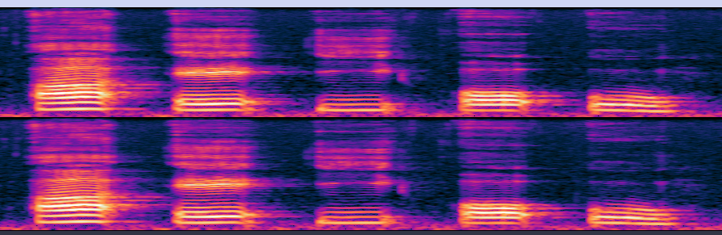

## 4_4
Frecventele emise de un contrabas sunt in intervalul [40, 200] Hz, atunci comform teoremei Nyquist-Shannon, frecventa minima de ensantionare a semnalul este fs > 200 * 2 -> fs = 401

## 4_5

In spectograma vocalele arata distinct diferite intre ele.

## 4_7
P_Semnal = 90dB si SNR_dB = 80dB

SNR_dB = 10log10(SNR)

SNR_db = 10log10(PSemnal/PZgomot)

SNR_db = 10(log10(PSemnal) - log10(PZgomot))

SNR_db = 10log10(PSemnal) - 10log10(PZgomot)

80 = 90 - PZgomot_db -> PZgomot_Db = 10
